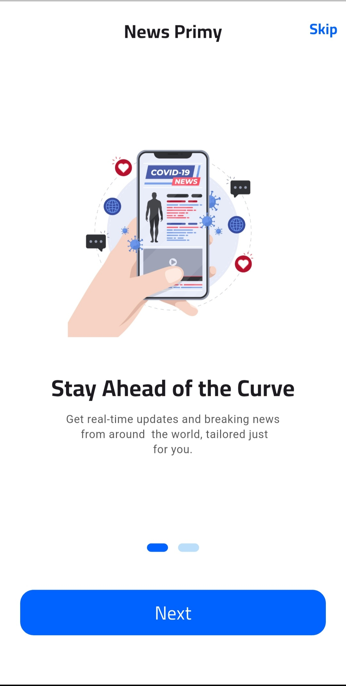
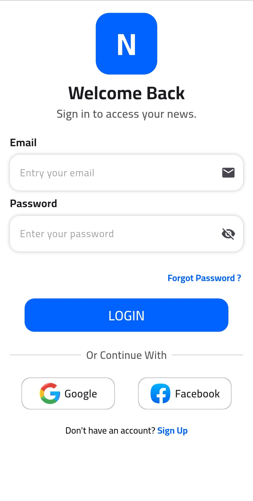
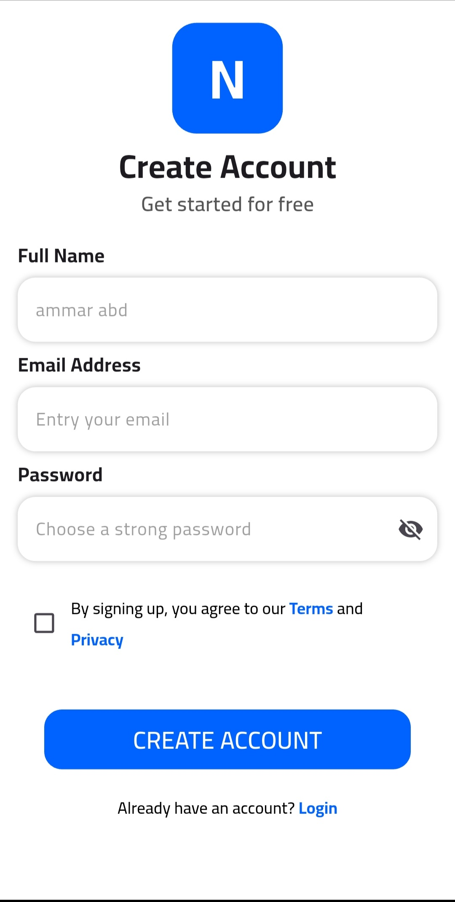
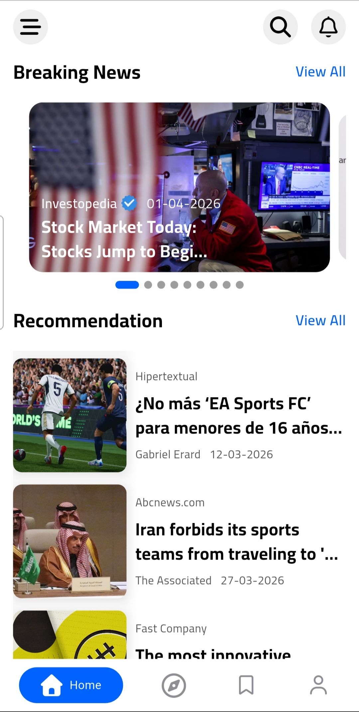
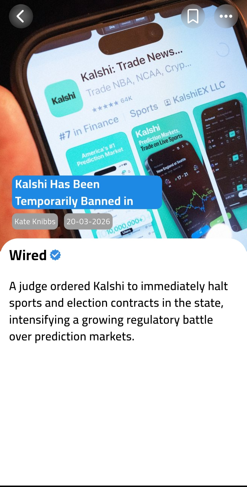
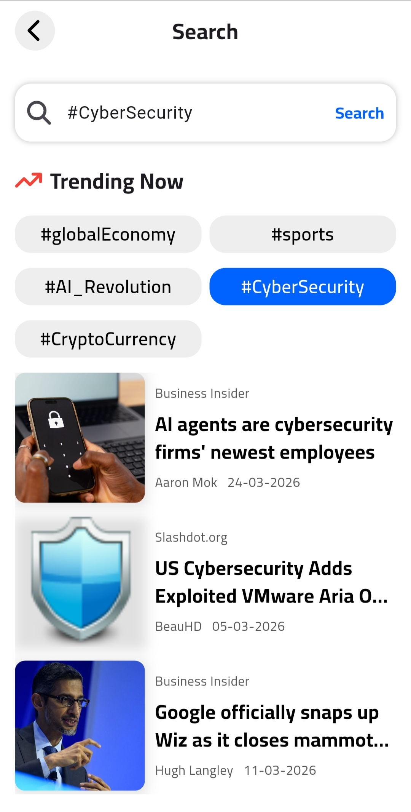
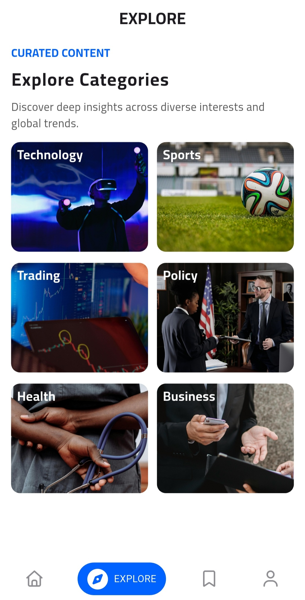
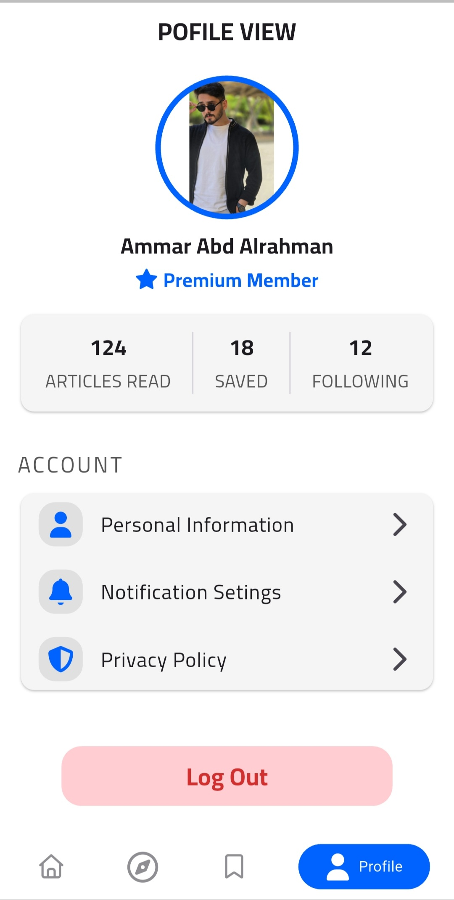

# 📰 News API Mobile App - Flutter Clean Architecture

A professional Flutter news application demonstrating an advanced implementation of **Clean Architecture** (Data, Domain, Presentation) combined with real-time API integration and local data persistence.

## 📸 App Screenshots

### 🏁 Startup 
| Splash Screen | Onboarding 1 | Onboarding 2 |
| :-: | :-: | :-: |
|  |  |  |

### 🔐 Authentication & Access
| Login Screen | Register Screen |
| :-: | :-: |
|  |  |

### 📰 Main Features
| Home Feed | News Details | Search | Search Results |
| :-: | :-: | :-: | :-: |
|  |  |  |  |

### 🧭 Explore & Categories
| Explore | Category | 
| :-: | :-: |
|  |  |

### 👤 User Space
| Bookmarks | Profile |
| :-: | :-: |
|  |  |

## 🛠 Technical Implementation
This project was built to showcase industry-standard Flutter development patterns and high-quality code structure:

* **Architecture:** Strictly followed **Clean Architecture** to ensure complete separation of concerns and high testability.
* **State Management:** Utilized **Cubit (Bloc)** for predictable, reactive, and efficient state handling.
* **Networking:** Integrated **Dio** for robust REST API communication, featuring interceptors and error handling.
* **Local Persistence:** Implemented **Hive** as a high-speed NoSQL database for caching news and enabling offline access.
* **Dependency Injection:** Integrated **Get_it** for service location to achieve a decoupled and modular codebase.
* **Backend & Auth:** Powered by **Firebase Authentication** to manage secure user registration and login sessions.

## 🏗 Project Structure & Patterns
The codebase is meticulously organized into layers to ensure scalability:

### 1. Presentation Layer
* **UI (Screens & Widgets):** Clean and modular UI components.
* **Logic (Cubit):** Managing UI states and reacting to user events.

### 2. Domain Layer (The Core)
* **Entities:** Pure business objects.
* **Use Cases:** Specific business logic rules.
* **Repositories (Interfaces):** Abstract definitions for data flow.

### 3. Data Layer
* **Models:** Data transfer objects (DTOs) with JSON serialization.
* **Repositories (Implementations):** Logic to decide between Remote (API) or Local (Hive) data.
* **Data Sources:** Direct implementation of Dio for News API and Hive for local storage.

## 🚀 Key Features
* **Live News Feed:** Fetching top headlines and categories using News API.
* **Secure Auth:** Full Authentication flow (Login/Register) via Firebase.
* **Offline Mode:** Users can read previously loaded news without an internet connection thanks to Hive.
* **Service Locator:** Centralized dependency management using Get_it.
